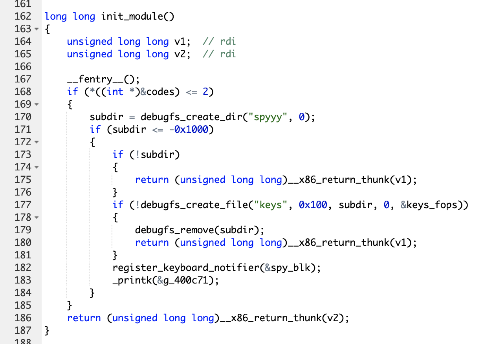

# ColossalBreach

| Nom | Catégorie | Difficulté | Point initial |
| :---: | :---: | :---: | :---: |
| ColossalBreach | Reverse | Medium | 1000 |

## Énoncé

> ...

Fichier [rev_colossalbreach.zip]()

Le challenge s'oriente autour de sept questions :

- [x] 1. Who is the module's author?
- [x] 2. What is the name of the function used to register keyboard events?
- [x] 3. What is the name of the function that convers keycodes to strings?
- [x] 4. What file does the module create to store logs? Provide the full path
- [x] 5. What message does the module print when imported?
- [x] 6. What is the XOR key used to obfuscate the keys? (e.g. 0x01, 0x32)
- [ ] 7. What is the password entered for 'adam'?

## Challenge 

Pour réaliser les challenges de reverse j'utilise trois outils :
 * Cutter (Désassembleur) [Cutter.re](https://cutter.re)
 * Ida Pro (Désassembleur) [hex-rays.com](https://hex-rays.com/ida-pro)
 * Dogbolt (Décompileur en ligne) [dogbolt.org](https://dogbolt.org/)

Cutter et Ida sont similaires mais comportent des fonctionnalitées différentes.  
Dogbolt me permet de décompiler un fichier avec plusieurs décompileurs (angr, BinaryNinja, Ghidra...)

### 1. Who is the module's author?
---
_Qui est l'auteur du module ?_

Dans l'onglet "string" de Cutter il est facile de repérer la valeur.

FLAG : `0xEr3n`

### 2. What is the name of the function used to register keyboard events?
---
_Quel est le nom de la fonction utilisé pour prendre en compte les évènements clavier ?_

En étudiant la fonction spy_init on repère une fonction avec un nom très proche de ce que l'on recherche.

FLAG : `register_keyboard_notifier`

### 3. What is the name of the function that convers keycodes to strings?
---
_Quel est le nom de la fonction qui convertie les valeurs en chaine de caractères ?_

Encore une fois la valeur est évidente il suffit de regarder la liste des fonctions pour voir celle qui correspond.

FLAG : `keycodes_to_strings`

### 4. What file does the module create to store logs? Provide the full path
---
_Dans quel fichier est créer par le module pour enregistrer les logs ? Donner le chemin complet._

Pour cette question il faut s'interesser à la fonction init du module ou `spy_init`. Dedans on peut voir l'appel de la fonction `debugfs_create_file` qui permet entre autre de créer le fichier `keys` ce qui nous donne le nom du fichier de log. 

Pour le chemin où est enregistrer ce fichier il faut regarder un peu plus haut dans la fonction init. On peut voir une fonction similaire `debugfs_create_dir` qui va elle créer le répertoire `spyyy`. Cela nous donne le nom du fichier et son répèrtoire parent mais pas son chemin complet. En lisant la documentation à propos de cette fonction on apprend que par défaut le répèrtoire est créer avec ce chemin `sys/kernel/debug/` ce qui nous permet de construire le chemin complet de notre fichier.

FLAG : `/sys/kernel/debug/spyyy/keys`*

* Merci à Ploc300 pour l'aide sur ce challenge !

### 5. What message does the module print when imported?
---
_Quel est le message affiché lorsque le module est importé ?_

Cette valeur se trouve dans la suite de ce que l'on vient d'analyser. Si on regarde bien après la création du fichier on aperçois la présence d'un printk. Si on regarde l'emplacement de la valeur affichée on trouve `0x08000cb2 .string "6w00tw00t\n"`.

FLAG : `w00tw00t`
### 6. What is the XOR key used to obfuscate the keys? (e.g. 0x01, 0x32)
---
_Quelle est la clé(valeur) XOR utilisé pour obfusquer les clés ?_

A l'aide d'une recherche on trouve rapidement dans la fonction `spy_cb` le XOR et il est appliqué avec la valeur 0x19(25).

FLAG : `0x19`
