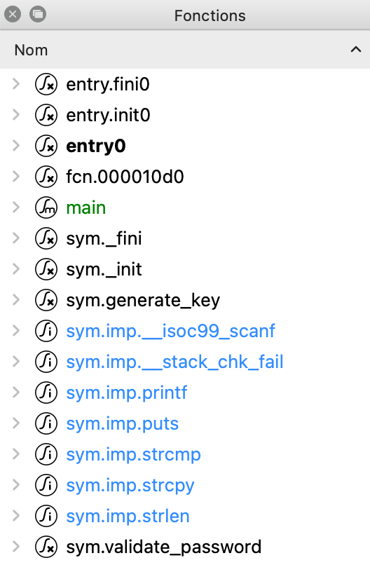
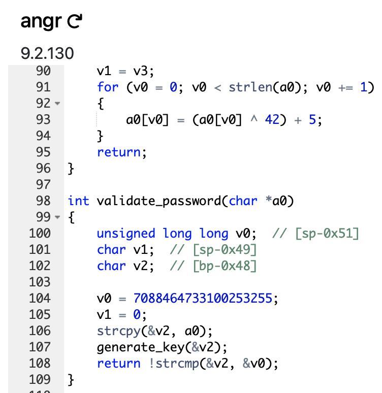
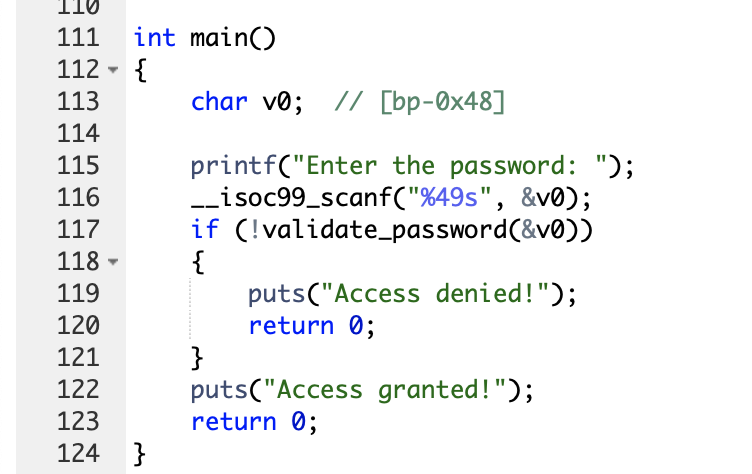
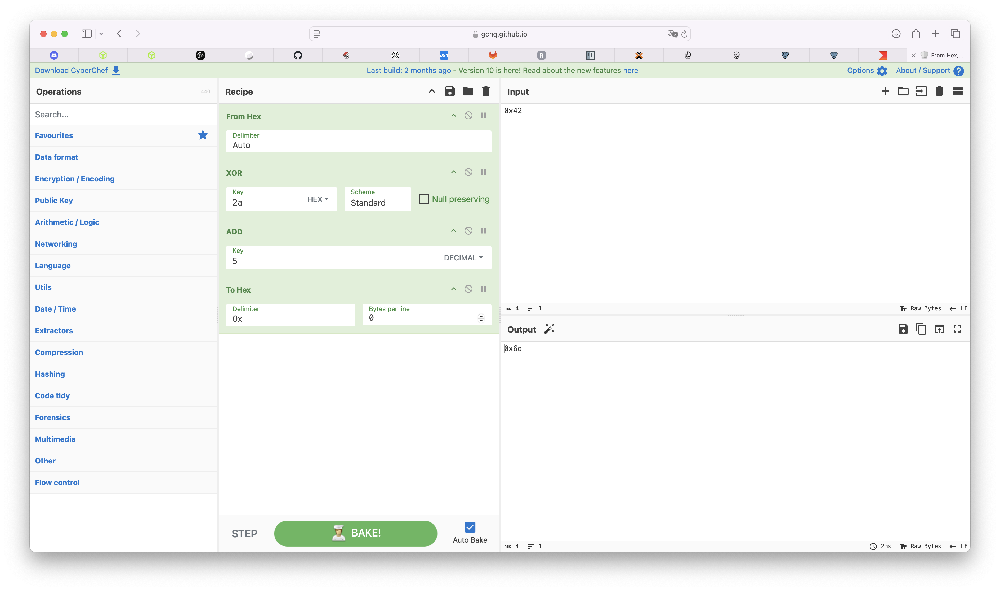
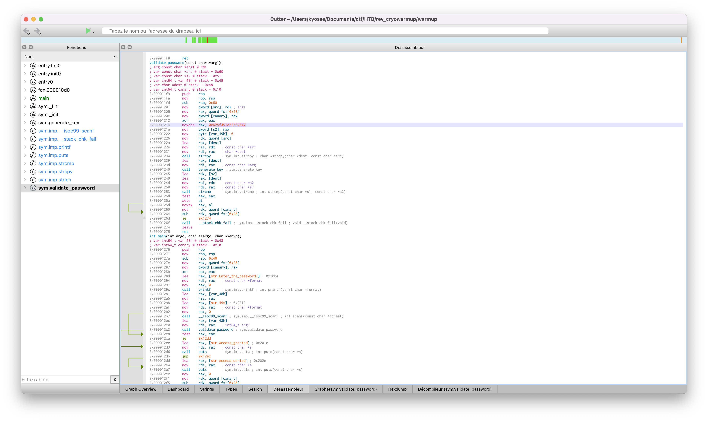
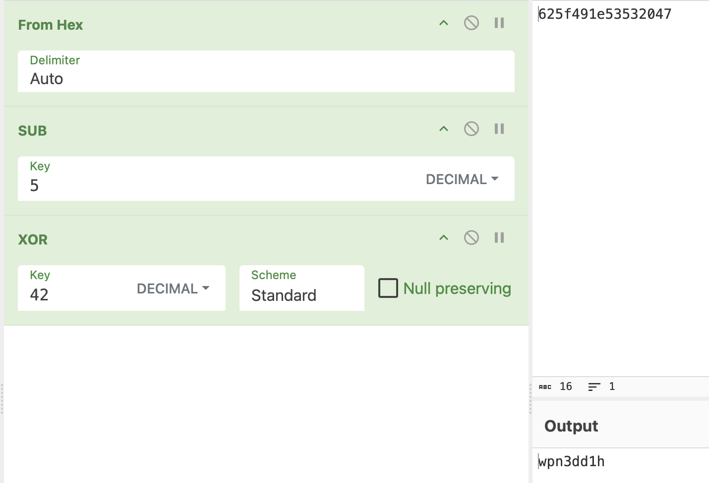

# CryoWarmup

| Nom | Catégorie | Difficulté | Point initial |
| :---: | :---: | :---: | :---: |
| CryoWarmup | Reverse | Very Easy | 1000 |

## Énoncé

>You've been on ice for a long time, so before you start your journey you'll need to defrost and warm up your skills. As luck would have it, you've forgotten the password to your trusty Electro-Safe-o-Matic, where your most prized possessions are. Can you still remember how to crack in?

Fichier [rev_cryowarmup.zip]()

Le challenge s'oriente autour de sept questions :

 - [x] 1. What libc function is used to check if the password is correct ?
 - [x] 2. What is the size of the password buffer, based on the argument to scanf ?
 - [x] 3. What is the name of the function that modifies the user's input ?
 - [x] 4. What would be the result of applying the operation from this function to a string containing one character, 'B' ? Provide your answer as a hex number, e.g. 0x4f.
 - [x] 5. What is printed if the password is correct ?
 - [x] 6. How long is the password, based on the value that the user's input is compared against (not including the final null byte) ?
 - [ ] 7. What is the password ?
 
## Challenge 


Pour réaliser les challenges de reverse j'utilise trois outils :
 * Cutter (Désassembleur) [Cutter.re](https://cutter.re)
 * Ida Pro (Désassembleur) [hex-rays.com](https://hex-rays.com/ida-pro)
 * Dogbolt (Décompileur en ligne) [dogbolt.org](https://dogbolt.org/)

Cutter et Ida sont similaires mais comportent des fonctionnalitées différentes. <br>
Dogbolt me permet de décompiler un fichier avec plusieurs décompileurs (angr, BinaryNinja, Ghidra...)

### 1. What libc function is used to check if the password is correct ?
---
_Quelle est la fonction libc utilisée pour vérifier que le mot de passe est correct ?_



Sous Cutter, dans la liste des fonctions on aperçoit très vite des noms qui attire la curiosité. Ici on nous demande le nom d'une fonction libc qui vérifie qu'il s'agit du bon mot de passe. La fonction `validate_password` semble être un bon candidat.



Après avoir posté le fichier sur Dogbolt, les différents décompilateurs renvoient leur
équivalent en C. Le décompilateur angr nous donne la fonction `validate_password` dans une version simple. Le mot de passe que l'utilisateur renseigne correspond à la variable `a0` (passé en paramètre de la fonction). On observe donc les étapes suivantes :
 - `a0` est copié avec la fonction `strcpy` dans la variable `v2`
 - `v2` passe ensuite dans la fonction generate_key
 - puis elle est comparée avec la variable `v0` à l'aide de la fonction `strcmp`
  
La fonction qui permet de vérifier la validité du mot de passe est donc la fonction libc `strcmp` qui permet de comparer deux chaines de caractère.

FLAG : `strcmp`

### 2. What is the size of the password buffer, based on the argument to scanf ?
---
_Quel est la taille du buffer pour le mot de passe, d'après les arguments du scanf ?_



Pour cela il nous faut trouver où se trouve l'appelle de la fonction `scanf`. On voit très vite qu'il se trouve dans la fonction `main`. Ici la fonction comporte deux paramètres. `"%49s"` détermine le type et la taille de valeur accèptée soit une chaine de caractère longue de 49 caractères maximum. `v0` correspond à la variable dans laquelle la variable doit-être attribuée. <br>
On en déduit donc que le buffer pour le mot de passe de l'utilisateur est 49.

FLAG : `49`

### 3. What is the name of the function that modifies the user's input ?
---
_Quel est le nom de la fonction qui modifie la valeur renseignée par l'utilisateur ?_

Comme vu dans le point 1, la valeur de l'utilisateur passe dans la fonction `generate_key` avant d'être comparée avec le mot de passe du fichier. Cette fonction permet de mettre en forme la valeur de l'utilisateur pour qu'elle corresponde au mot de passe du fichier.

FLAG : `generate_key`

### 4. What would be the result of applying the operation from this function to a string containing one character, 'B' ? Provide your answer as a hex number, e.g. 0x4f.
---
_Quel serait le résultat de la fonction generate_key sur une chaine d'un seul caractère, 'B' ? Donner votre réponse sous forme d'un nombre hexadécimal._


Pour répondre à cette question il faut comprendre la logique derrière la fonction `generate_key`. En l'examinant on comprend qu'il s'agit d'un boucle de la longueur de la variable `arg1` qu'on lui donne en argument. Cette boucle parcours tous les caractères de cette variable et applique les opérandes suivantes :
 * XOR avec 0x2A
 * ADD de 5
  
Soit en pseudo-code :
```
Pour tous les caractères dans argument1 fait
    caractère = (caractère ^ 0x2A) + 5
Fin Pour
```
En suivant cette logique il est possible de déterminer la valeur pour 'B'. Sur Cyberchef on obtient :




FLAG : `0x6d`*

*Pour une raison étrange il m'était impossible de valider ce flag malgré ma réponse correct. Bravo à Arikihiko qui a réussi à flag tout seul.

### 5. What is printed if the password is correct ?
---
_Quel message est affiché lorsque le mot de passe est correct ?_

Pour cette question il est possible de regarder le point 2 pour rapidement repérer le message. Sinon, il est possible de regarder dans l'onglet "String" de cutter. Cette onglet affiche toutes les valeurs qu'il arrive à reconnaître. Permis ces valeurs on peut remarquer la phrase "Access granted!".
FLAG : `Access granted!`

### 6. How long is the password, based on the value that the user's input is compared against (not including the final null byte) ?
---
_De quel longueur est le mot de passe, d'après la valeur avec laquelle est comparée le mot de passe de l'utilisateur ? (sans compter l'octet null de fin)_




`0x625f491e53532047` Voici avec quoi est comparée la valeur de l'utilisateur. On déduit rapidement qu'il s'agit de 8 caractères codés en hexadécimale.

FLAG : `8`

### 7. What is the password ?
---
_Quel est le mot de passe ?_


Pour retrouver le mot de passe il faut déchiffrer la valeur avec laquelle l'entrée de l'utilisateur est comparée. Comme vu dans le point 6, il s'agit de `0x625f491e53532047`. Depuis le point 4 on connaît le fonctionnement de la fonction `generate_key` et donc comment a été chiffré le mot de passe. Pour le déchiffrer il faut donc inverser les étapes c'est à dire :
* Soustraire 5
* XOR avec 0x2A

Et ce pour chaque valeur.



Voilà où nous somme arrivé `wpn3dd1h`. Le manque d'attention de notre part a été de ne pas remarquer que la valeur était retournée pendant sa modification ce qui nous a value le flag.

FLAG : `h1dd3npw'
